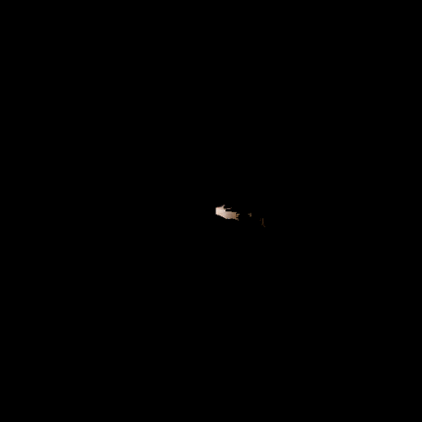

# LiDAR-SLAM with Pose Graph Optimizaiton
In this project, we implement Simultaneous Localization and Mapping (SLAM) using a mobile robot equipped with wheel encoders, IMU, LiDAR, and an RGBD camera. 

We use LiDAR-based ICP scan matching and camera images to generate occupancy and floor texture maps. Pose graph optimization with loop closures is done to refine the robot trajectory and build maps.

<div style="text-align:center;">
    
    <p><em>Figure 1: Floor Texture Map being generated using LiDAR SLAM.</em></p>
</div>


## Environment Setup and Package Installation

To set up the required environment and install the necessary packages, execute the following commands:

```bash
conda create -n <ENV_NAME> python=3.8
conda activate <ENV_NAME>
pip install -r requirements.txt
```

## Folder Structure
The project is organized as follows,

```bash
.
├── data
│   ├── dataRGBD
│   │   ├── Disparity20
│   │   ├── Disparity21
│   │   ├── RGB20
│   │   └── RGB21
│   ├── Encoders20.npz
│   ├── Encoders21.npz
│   ├── Hokuyo20.npz
│   ├── Hokuyo21.npz
│   ├── Imu20.npz
│   ├── Imu21.npz
│   ├── Kinect20.npz
│   ├── Kinect21.npz
│   └── KinectData.zip
├── icp
│   ├── icp.py
│   ├── utils.py
│   └── warm_up_data
│       ├── drill
│       └── liq_container
├──  utils
│    ├── pr2_utils.py
│    └── test_ranges.npy
├── img
├── test_gtsam.py
├── test_icp.py
├── odometry.py
├── occupancy_texture.py
├── pose_graph.py
└── main.py
```


## ICP testing script

Run the following code to test the ICP warm-up,
```bash
python3 test_icp.py --object drill
```
There are two available objects `drill` and `liq_container`, with 4 point clouds each. Open3D visualizer will open sequentially. After closing the visualizer, ICP runs for the next point cloud and simultaneous visualizers will pop up.

NOTE: If you're on Ubuntu 20.04 or later, and encountering OpenGL errors -- such as failing to initialize GLEW or crashes during visualization, please refer to [Open3D Issue #6872](https://github.com/isl-org/Open3D/issues/6872).

## LiDAR-SLAM

Use the following command to run the main program,
```bash
python3 main.py --dataset 20
```
Arguments:
- `--dataset` - Select from two available datasets `20` and `21`
- `--loop_length` - Number of poses for loop closure constraint in pose graph optimization (default: `10`)

Note: After running the script, 6 pop-up windows will sequentially in the order
- Trajectory comparison plot
- Occupancy Grid for LiDAR ICP based trajectory
- Texture Map for LiDAR ICP based trajectory
- Optimized trajectory comparison plot 
- Occupancy Grid for optimized trajectory
- Texture Map for optimized trajectory
